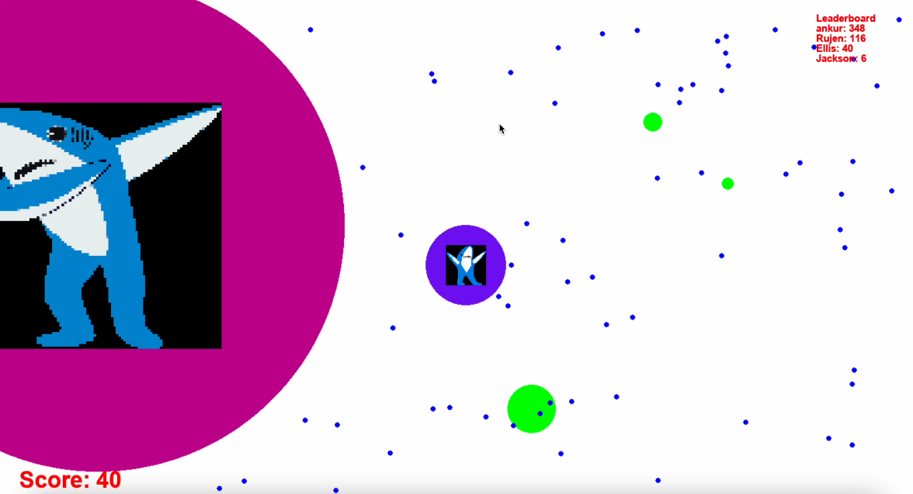

# Concurrency 2022 Spring : Shark IO
###  By` Mark's` `Sharks`: Ankur Dahal, Ellis Brown, Jackson Parsells, Rujen Amatya 

### We designed the game __SharkIO__ in python3 using PyGame, which is inspired by agar.io. Multiple players concurrently move around a map eating food and each other to gain size, while avoiding viruses. Each player has their own window centered around their character, and uses [W S A D] controls to move. To win, you have to be the largest shark in the sea!

### Our game uses a multithreaded server implementation to handle the concurrent gameplay. Each player is represented by a thread on the server side. A server thread also handles players joining the game, and another thread handles spawning food. Our main challenges were creating threadsafe classes for modifying the game state, and handling game logic without introducing gamebreaking due to race conditions. To do this, we used locks around critical regions of the code, where shared memory was accessed. 

### We had lots of fun. Try it out! => [https://github.com/dahalankur/SharkIO](https://github.com/dahalankur/SharkIO)